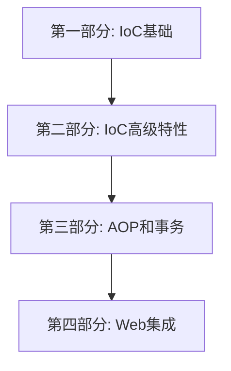

# Mini-Spring Framework


## 项目简介
Mini-Spring 是一个简化版的 Spring 框架，旨在帮助开发者深入理解 Spring 的核心原理和实现机制。本项目采用问题驱动的方式，通过实现核心功能模块，让学习者能够深入理解 Spring 的设计思想和实现原理。

## 学习路线图


## 学习建议
1. 学习之前弄懂反射和动态代理
3. 按照顺序阅读，每个章节都建立在前面章节的基础之上
4. 先看星球文档，后面有时间再钻研代码

## 项目结构
````
mini-spring
```
src/main/java/com/minispring/
├── beans
│   ├── factory
│   │   ├── config
│   │   │   ├── Scope相关接口和实现
│   │   │   └── ...
│   │   ├── support
│   │   └── xml
│   ├── BeansException.java
│   ├── PropertyValue.java
│   ├── PropertyValues.java
│   └── ...
├── context
│   ├── event
│   ├── support
│   ├── ApplicationContext.java
│   └── ...
├── core
│   ├── io
│   ├── convert
│   │   ├── converter
│   │   ├── support
│   │   └── ...
│   └── ...
├── aop
│   ├── framework
│   ├── aspectj
│   ├── Advisor.java
│   ├── PointcutAdvisor.java
│   └── ...
├── web
│   ├── context
│   │   ├── request
│   │   │   ├── RequestScope.java
│   │   │   ├── SessionScope.java
│   │   │   └── ...
│   │   └── ...
│   └── ...
└── util
    └── ...
```
````

## 环境要求
- JDK 17+
- Maven 3.8.1+
- IDE（推荐IntelliJ IDEA）
- Git

## 快速开始

### 1. 获取代码
```bash
# 克隆项目
git clone https://github.com/youngyangyang04/mini-spring.git

# 进入项目目录
cd mini-spring
```

### 2. 编译运行
```bash
# 编译项目
mvn clean install

# 运行测试
mvn test
```

### 3.运行测试用例
项目包含完整的测试用例，覆盖了框架的主要功能：
- IoC容器测试
- AOP功能测试
- 事务管理测试

可以通过IDE或命令行运行这些测试：
```bash
# 运行所有测试
mvn test

# 运行特定测试类
mvn test -Dtest=DefaultListableBeanFactoryTest

# 运行特定测试方法
mvn test -Dtest=DefaultListableBeanFactoryTest#testGetBean
```

### 5. 开发建议
- 建议使用IDE（如IntelliJ IDEA）导入项目
- 确保已安装JDK 17及以上版本
- 推荐使用Maven 3.8.1及以上版本
- 运行测试前先执行`mvn clean install`

## 学习成果

完成本教程后，你将：
1. 深入理解Spring核心原理
2. 掌握框架设计的关键技术
3. 提升架构设计能力
4. 能够回答相关面试题
5. 具备框架开发能力

## 如何贡献
1. Fork 本仓库
2. 创建新的分支 `git checkout -b feature/your-feature`
3. 提交你的修改 `git commit -m 'Add some feature'`
4. 推送到分支 `git push origin feature/your-feature`
5. 创建 Pull Request

## 问题反馈
- 在GitHub Issues中提问
- 通过Pull Request贡献内容
- 查看文档中的常见问题解答

## 开源协议
本项目采用 MIT 协议开源，详见 [LICENSE](LICENSE) 文件。 